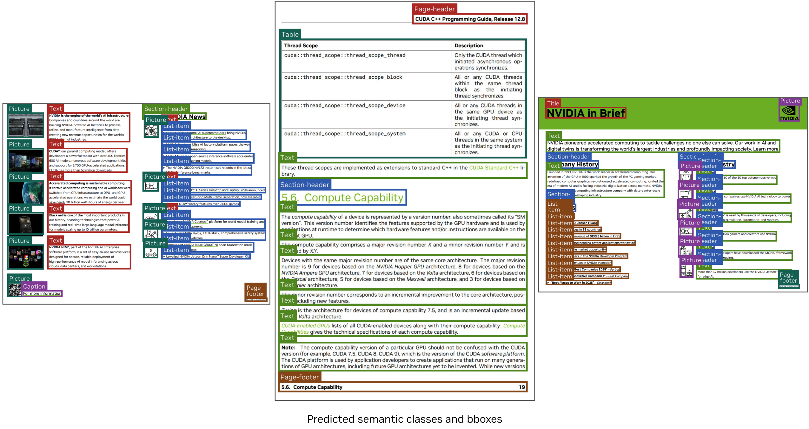
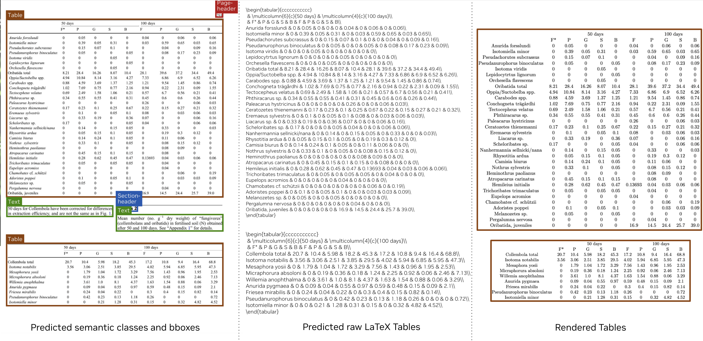
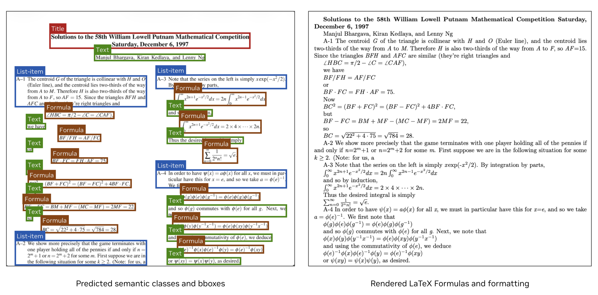

# NVIDIA Nemotron Parse v1.1 Overview

NVIDIA Nemotron Parse v1.1 is designed to understand document semantics and extract text and tables elements with spatial grounding. Given an image, NVIDIA Nemotron Parse v1.1 produces structured annotations, including formatted text, bounding-boxes and the corresponding semantic classes, ordered according to the document's reading flow. It overcomes the shortcomings of traditional OCR technologies that struggle with complex document layouts with structural variability, and helps transform unstructured documents into actionable and machine-usable representations. This has several downstream benefits such as increasing the availability of training-data for Large Language Models (LLMs), improving the accuracy of extractor, curator, retriever and AI agentic applications, and enhancing document understanding pipelines.

This model is ready for commercial use.

## License 
GOVERNING TERMS: The NIM container is governed by the [NVIDIA Software License Agreement](https://www.nvidia.com/en-us/agreements/enterprise-software/nvidia-software-license-agreement/) and [Product-Specific Terms for NVIDIA AI Products](https://www.nvidia.com/en-us/agreements/enterprise-software/product-specific-terms-for-ai-products/). Use of this model is governed by the  [ NVIDIA Open Model License Agreement](https://www.nvidia.com/en-us/agreements/enterprise-software/nvidia-open-model-license/). Use of the tokenizer included in this model is governed by the [CC-BY-4.0 license](https://creativecommons.org/licenses/by/4.0/).


## Deployment Geography:
Global

## Use Case:
NVIDIA Nemotron Parse v1.1 will be capable of comprehensive text understanding and document structure understanding. It will be used in retriever and curator solutions. Its text extraction datasets and capabilities will help with LLM and VLM training, as well as improve run-time inference accuracy of VLMs.
The NVIDIA Nemotron Parse v1.1 model will perform text extraction from PDF and PPT documents. The NVIDIA Nemotron Parse v1.1 can classify the objects (title, section, caption, index, footnote, lists, tables, bibliography, image) in a given document, and provide bounding boxes with coordinates. 


## Release Date:
November 17, 2025 


## References 
* https://huggingface.co/docs/transformers/en/model_doc/mbart


## Model Architecture 

### Architecture Type : 
Transformer-based vision-encoder-decoder model

### Network Architecture 
* Vision Encoder: ViT-H model (https://huggingface.co/nvidia/C-RADIO)<br>
* Adapter Layer: 1D convolutions & norms to compress dimensionality and sequence length of the latent space (13184 tokens to 3201 tokens)<br>
* Decoder: mBart [1] 10 blocks<br>
* Tokenizer: Use of the tokenizer included in this model is governed by the [CC-BY-4.0 license](https://creativecommons.org/licenses/by/4.0/)<br>
* Number of Parameters: < 1B<br>


## Computational Load (For NVIDIA Models Only) 
**Cumulative Compute:**  2.2e+22 <br>
**Estimated Energy and Emissions for Model Training:** 
Energy Consumption: 7,827.46 kWh <br>
Carbon Emissions: 3.21 tCO2e <br>

### Input 
* Input Type: Image, Text<br>
* Input Type(s): Red, Green, Blue (RGB) + Prompt (String)
* Input Parameters: 2D, 1D
- Other Properties Related to Input:
  - Max Input Resolution (Width, Height): 1648, 2048
  - Min Input Resolution (Width, Height): 1024, 1280
- Channel Count: 3

### Output 
* Output Type: Text<br>
* Output Format: String
* Output Parameters: 1D
- Other Properties Related to Output:
  - NVIDIA Nemotron Parse v1.1 output format is a string which encodes text content (formatted or not) as well as bounding boxes and class attributes.<br>
 In the default prompt setting, text content is represented as markdown, and math expressions as LaTeX, enclosed in \[..\] or \(..\). If a mathematical expression does not require LaTeX formatting to be represented (e.g., consisting only of characters and subscripts/superscripts), it is represented as markdown. Tables are represented as LaTeX. 
  Our AI models are designed and/or optimized to run on NVIDIA GPU-accelerated systems. By leveraging NVIDIA’s hardware (e.g. GPU cores) and software frameworks (e.g., CUDA libraries), the model achieves faster training and inference times compared to CPU-only solutions.<br>

## Software Integration:

Runtime Engine(s): TensorRT-LLM

Supported Hardware Microarchitecture Compatibility: <br>
NVIDIA Hopper/NVIDIA Ampere/NVIDIA Turing<br>

Supported Operating System(s): Linux<br>

The integration of foundation and fine-tuned models into AI systems requires additional testing using use-case-specific data to ensure safe and effective deployment. Following the V-model methodology, iterative testing and validation at both unit and system levels are essential to mitigate risks, meet technical and functional requirements, and ensure compliance with safety and ethical standards before deployment.<br>

## Model Version:

V1.1. A faster version of Nemotron-Parse is available as well: [Nemotron-Parse-v1.1-TC](https://huggingface.co/nvidia/NVIDIA-Nemotron-Parse-v1.1-TC)

## Quick Start

### Install dependencies in your environment

```bash
pip install -r requirements.txt
```

Alternatively, you can use a public image _nvcr.io/nvidia/pytorch:25.03-py3_ with the following library versions installed on top:
```bash
pip install accelerate==1.12.0
pip install albumentations==2.0.8
pip install transformers==4.51.3
pip install timm==1.0.22
```

### Usage example

```python
import torch
from PIL import Image, ImageDraw
from transformers import AutoModel, AutoProcessor, AutoTokenizer, AutoConfig, AutoImageProcessor, GenerationConfig
from postprocessing import extract_classes_bboxes, transform_bbox_to_original, postprocess_text

# Load model and processor
model_path = "nvidia/NVIDIA-Nemotron-Parse-v1.1"  # Or use a local path
device = "cuda:0"

model = AutoModel.from_pretrained(
    model_path,
    trust_remote_code=True,
    torch_dtype=torch.bfloat16
).to(device).eval()
tokenizer = AutoTokenizer.from_pretrained(model_path)
processor = AutoProcessor.from_pretrained(model_path, trust_remote_code=True)

# Load image
image = Image.open("path/to/your/image.jpg")
task_prompt = "</s><s><predict_bbox><predict_classes><output_markdown>"

# Process image
inputs = processor(images=[image], text=task_prompt, return_tensors="pt").to(device)
prompt_ids = processor.tokenizer.encode(task_prompt, return_tensors="pt", add_special_tokens=False).cuda()


generation_config = GenerationConfig.from_pretrained(model_path, trust_remote_code=True)
# Generate text
outputs = model.generate(**inputs,  generation_config=generation_config)

# Decode the generated text
generated_text = processor.batch_decode(outputs, skip_special_tokens=True)[0]
```
### Postprocessing

```python
from PIL import Image, ImageDraw
from postprocessing import extract_classes_bboxes, transform_bbox_to_original, postprocess_text

classes, bboxes, texts = extract_classes_bboxes(generated_text)
bboxes = [transform_bbox_to_original(bbox, image.width, image.height) for bbox in bboxes]

# Specify output formats for postprocessing
table_format = 'latex' # latex | HTML | markdown
text_format = 'markdown' # markdown | plain
blank_text_in_figures = False # remove text inside 'Picture' class
texts = [postprocess_text(text, cls = cls, table_format=table_format, text_format=text_format, blank_text_in_figures=blank_text_in_figures) for text, cls in zip(texts, classes)]

for cl, bb, txt in zip(classes, bboxes, texts):
    print(cl, ': ', txt)

draw = ImageDraw.Draw(image)
for bbox in bboxes:
  draw.rectangle((bbox[0], bbox[1], bbox[2], bbox[3]), outline="red")
```

## Inference with VLLM

**Update**: Nemotron-Parse-v1.1 is now [available in vllm main](https://github.com/vllm-project/vllm/pull/30864) and can be found in [vllm/vllm-openai:nightly docker image](https://hub.docker.com/layers/vllm/vllm-openai/nightly/images/sha256-985e1e302332a505c3a90e1bbe85f8ae6e6cb47abea35ee2cbdc13fe7832e053). 

You will need to install *albumentations* on top, and then follow the VLLM Inference example below:
```bash
pip install albumentations
```

### VLLM Inference example

#### Option 1: end-to-end python inference
```python
from vllm import LLM, SamplingParams
from PIL import Image

def main():
    sampling_params = SamplingParams(
        temperature=0,
        top_k=1,
        repetition_penalty=1.1,
        max_tokens=9000,
        skip_special_tokens=False,
    )
    
    llm = LLM(
        model="nvidia/NVIDIA-Nemotron-Parse-v1.1",
        max_num_seqs=64,
        limit_mm_per_prompt={"image": 1},
        dtype="bfloat16",
        trust_remote_code=True,
    )
    
    image = Image.open("<YOUR-IMAGE-PATH>")
    
    prompts = [
        {  # Implicit prompt
            "prompt": "</s><s><predict_bbox><predict_classes><output_markdown>",
            "multi_modal_data": {
                "image": image
            },
        },
        {  # Explicit encoder/decoder prompt
            "encoder_prompt": {
                "prompt": "",
                "multi_modal_data": {
                    "image": image
                },
            },
            "decoder_prompt": "</s><s><predict_bbox><predict_classes><output_markdown>",
        },
    ]
    
    outputs = llm.generate(prompts, sampling_params)
    
    for output in outputs:
        prompt = output.prompt
        generated_text = output.outputs[0].text
        print(f"Decoder prompt: {prompt!r}, Generated text: {generated_text!r}")

if __name__ == "__main__":
    main()
```

#### Option 2: vllm serve

Alternatively, you can start a vllm server as:
```bash
vllm serve nvidia/NVIDIA-Nemotron-Parse-v1.1 \
    --dtype bfloat16 \
    --max-num-seqs 8 \
    --limit-mm-per-prompt '{"image": 1}' \
    --trust-remote-code \
    --port 8000 \
    --chat-template chat_template.jinja
```
with *chat_template.jinja* provided in this repository. Then, you can run inference as:

```python
import base64
from openai import OpenAI

client = OpenAI(
    base_url="http://localhost:8000/v1",
)

# Read and base64-encode the image
with open(<your-image-path>, "rb") as f:
    img_b64 = base64.b64encode(f.read()).decode("utf-8")

prompt_text = "</s><s><predict_bbox><predict_classes><output_markdown>"

resp = client.chat.completions.create(
    model="nvidia/NVIDIA-Nemotron-Parse-v1.1",
    messages=[
        {
            "role": "user",
            "content": [
                {
                    "type": "text",
                    "text": prompt_text,
                },
                {
                    "type": "image_url",
                    "image_url": {
                        "url": f"data:image/png;base64,{img_b64}",
                    },
                },
            ],
        }
    ],
    max_tokens=9000,
    temperature=0.0,
    extra_body={
        "repetition_penalty": 1.1,
        "top_k": 1,
        "skip_special_tokens": False,
    },
)

print(resp.choices[0].message.content)
```

*Note:* we recommend using the default prompt that extracts bounding boxes, classes, and text in markdown formatting for all use cases (`</s><s><predict_bbox><predict_classes><output_markdown>`). If necessary, optionally the prompt that omits text extraction and only outputs bounding boxes and classes could be used: `</s><s><predict_bbox><predict_classes><output_no_text>`.

Nemotron-Parse-v1.1 is also available as an [optimized NIM container](https://build.nvidia.com/nvidia/nemotron-parse).

[**Deprecated**] An alternative way is to run vllm is with our fork (based on v0 vllm) according to installation instructions below, and then following the VLLM inference examples above:

<ul><ul><ul>

```bash
    uv venv --python 3.12 --seed
    source .venv/bin/activate
    uv pip install "git+https://github.com/amalad/vllm.git@nemotron_parse"
    uv pip install timm albumentations
```
</ul></ul></ul>

## Nemotron-Parse-v1.1 Output Examples

### Layout understanding

Nemotron-Parse-v1.1 is capable of extracting text elements and their bounding boxes, along with a semantic class association.



### Table extraction

Nemotron-Parse-v1.1 extracts complex tables in LaTeX format, including for multirow and multicolumn formatting.



### Formatting and equations extraction

Extraction of text styles and mathematical equations is supported via a combination of markdown and LaTeX formatting.



## Training, Testing, and Evaluation Datasets:


### Training Dataset 

NVIDIA Nemotron Parse 1.1 is first pre-trained on our internal datasets: human, synthetic and automated.
Data Modality:
*Text
*Image<br>
Data Collection Method by Dataset: Hybrid: Human, Synthetic, Automated
Labeling Method by Dataset: Hybrid: Human, Synthetic, Automated

### Testing and Evaluation Dataset:

NVIDIA Nemotron Parse 1.1 is evaluated on multiple datasets for robustness, including public and internal dataset.
Data Collection Method by Dataset: Hybrid: Human, Synthetic, Automated
Labeling Method by Dataset: Hybrid: Human, Synthetic, Automated


## Inference 

Runtime Engine(s): TensorRT-LLM

Test Hardware: NVIDIA H100# Synchronization

## Ethical Considerations

NVIDIA believes Trustworthy AI is a shared responsibility and we have established policies and practices to enable development for a wide array of AI applications. When downloaded or used in accordance with our terms of service, developers should work with their supporting model team to ensure this model meets requirements for the relevant industry and use case and addresses unforeseen product misuse.

Please report security vulnerabilities or NVIDIA AI Concerns here.

**You are responsible for ensuring that your use of NVIDIA AI Models complies with all applicable laws.**


## Enterprise Support
Get access to knowledge base articles and support cases or [submit a ticket](https://www.nvidia.com/en-us/data-center/products/ai-enterprise-suite/support/).

## Citation
```
@misc{chumachenko2025nvidianemotronparse11,
      title={NVIDIA Nemotron Parse 1.1}, 
      author={NVIDIA},
      year={2025},
      eprint={2511.20478},
      archivePrefix={arXiv},
      primaryClass={cs.LG},
      url={https://arxiv.org/abs/2511.20478}, 
}
```